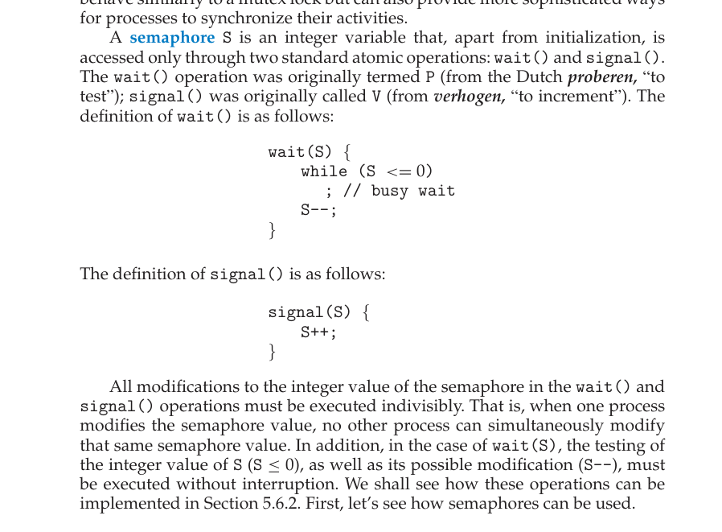
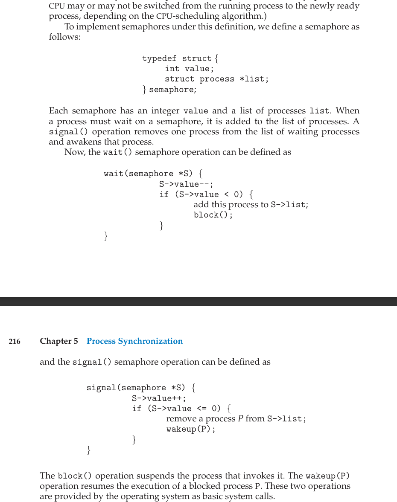

# 进程同步的软件实现方法

## 单标志法

## 双标志先检查法

## 双标志后检查法

 
## peterson算法

 

# 进程同步的硬件现方法

## 中断屏蔽法

## Test and Set指令

## Swap指令

## 信号量

## 整型信号量
 
 
    wait操作是原语不可被中断，那么wait进入while时发生了忙等待，岂不是会一直占用cpu资源。因为原语不能被中断，导致cpu卡在了这个while循环中？
 
>这里的实现代码只是一个例子，真实的信号量并不是这么实现的。信号量与锁不同，是通过信号发出调度提醒。所以真实情况是，信号量去提醒进程继续执行，而不是进程反复检测信号量。

    如果我们使用RR策略，时间片的时间很短，不支持我们完成某个原语操作，这时候进程还能执行成功吗？

>首先，时间片相对于原语是很长的，这个概率很小。即使在原语执行途中发生中断，仍然会有继续执行，因为原语是在硬件层面上实现的。
 ## 记录型信号量

# 死锁

## 四个必要基本条件

- 互斥条件（Mutual Exclusion）：至少有一个资源只能被一个进程（线程）占用，即在一段时间内只能由一个进程使用。
- 占有且等待条件（Hold and Wait）：进程（线程）至少占有一个资源，并且正在等待获取其他进程（线程）占有的资源。
- 无抢占条件（No Preemption）：资源不能被强制从一个进程（线程）中抢占，只能由持有它的进程（线程）显式释放。
- 循环等待条件（Circular Wait）：存在一个进程（线程）链，每个进程（线程）都在等待下一个进程（线程）所持有的资源。